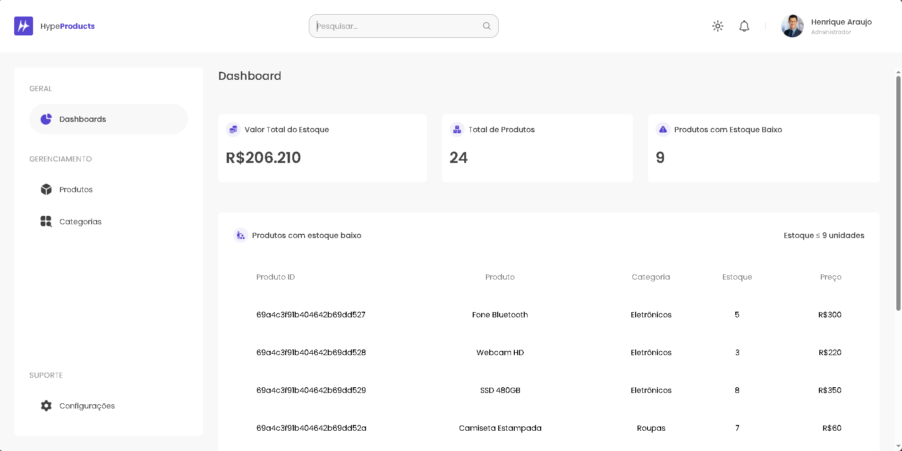
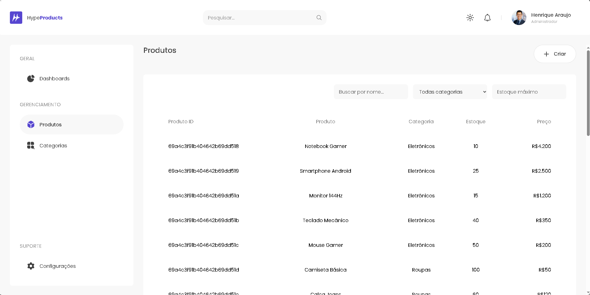
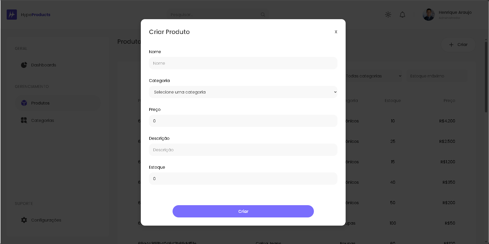

# 🧠 Hypesoft Product Manager

Sistema fullstack de gerenciamento de produtos com controle de estoque em tempo real, desenvolvido com arquitetura em camadas e containerização via Docker.

Projeto focado em boas práticas de desenvolvimento, organização de código e experiência do usuário.

## 🚀 Tecnologias

- Frontend: React + Vite
- Backend: .NET (C#)
- Banco de dados: MongoDB
- Containerização: Docker + Docker Compose

## 📦 Pré-requisitos

Antes de começar, você precisa ter instalado:

- Docker
- Docker Compose
- Node.js (caso queira rodar o frontend fora do container)

## ⚙️ Instalação e execução

### 1. Clone o repositório

```bash
git clone <URL_DO_REPOSITORIO>
cd hypesoft-product-manager
```

### 2. Instale as dependências do frontend

```bash
cd frontend
npm install
cd ..
```

### 3. Suba os containers com Docker
```bash
docker-compose up --build
```

## 🌐 Acessos

Após subir o projeto, acesse:

- Frontend: http://localhost:3000
- API (Swagger): http://localhost:5000/swagger
- Mongo Express: http://localhost:8081

## 📁 Estrutura do projeto
```bash
HYPERSOFT-PRODUCT-MANAGER/
├── backend/
│   └── src/
│       ├── Hypesoft.API/
│       ├── Hypesoft.Application/
│       ├── Hypesoft.Domain/
│       └── Hypesoft.Infrastructure/
│
├── frontend/
│   └── src/
│       ├── assets/
│       ├── components/
│       ├── pages/
│       ├── routes/
│       ├── services/
│       ├── hooks/
│       └── utils/
│
├── docs/
│   └── images/
│
├── docker-compose.yml
└── README.md
```

## 🧠 Arquitetura

O backend foi estruturado seguindo princípios de Clean Architecture:

- **API**: Camada de entrada (controllers e endpoints)
- **Application**: Regras de negócio e casos de uso
- **Domain**: Entidades e contratos
- **Infrastructure**: Acesso a dados e integrações externas

O frontend segue uma estrutura baseada em componentes reutilizáveis e separação por responsabilidade.

## ⚙️ Decisões técnicas

- MongoDB utilizado pela flexibilidade de schema, facilitando a modelagem dos produtos e evolução da estrutura
- Docker adotado para garantir padronização do ambiente e facilitar a execução do projeto
- Arquitetura em camadas para melhor organização, manutenção e escalabilidade do backend
- Vite utilizado no frontend pela rapidez no desenvolvimento e build

## 🔌 API

Principais funcionalidades da API:

- CRUD completo de produtos
- Controle de estoque
- Atualização de quantidade em tempo real
- Endpoint de dashboard com métricas de estoque

### Endpoints:

- GET /produtos → Lista todos os produtos
- POST /produtos → Cria um novo produto
- PUT /produtos/{id} → Atualiza um produto
- DELETE /produtos/{id} → Remove um produto
- GET /dashboard → Retorna métricas do estoque

## 🧪 Testes

A aplicação pode ser testada via Swagger:
http://localhost:5000/swagger

## 📸 Interface



